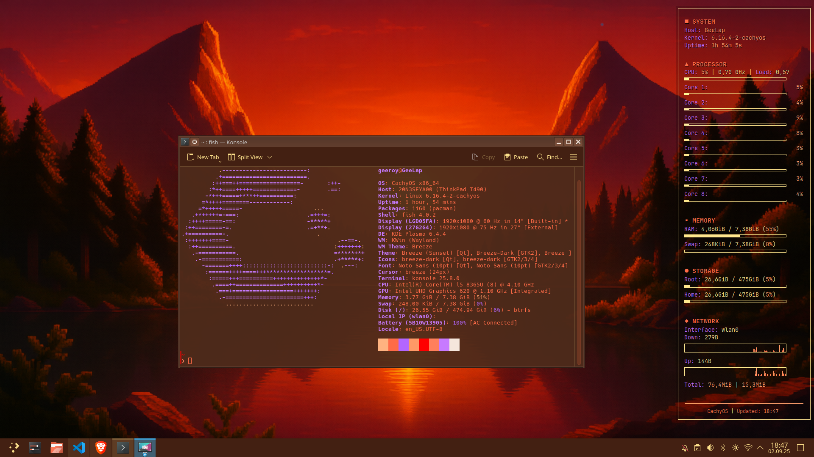
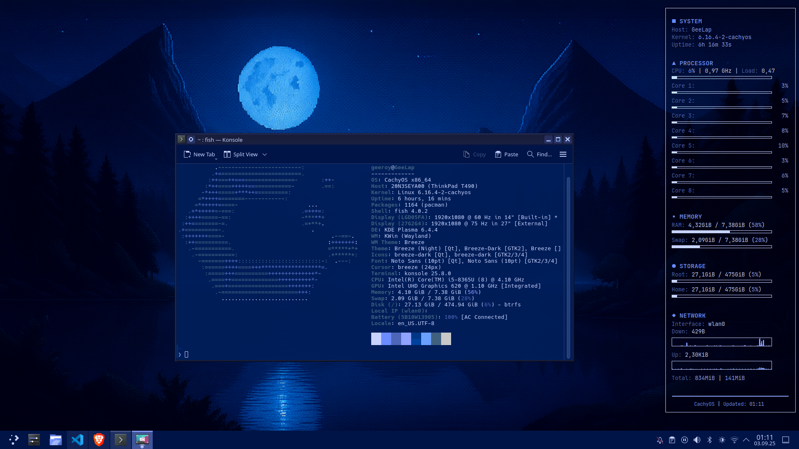

# 🌅 Time-Based KDE / Conky / Konsole / VSCode Theming (CachyOS)

Automates **wallpaper**, **Plasma color scheme**, **Conky**, **Konsole profile**, and **VSCode theme** based on the time of day:

- **🌅 Sunrise** (06:00–11:59) → VSCode: *Palenight (Mild Contrast)*
- **☀️ Noon** (12:00–17:59) → VSCode: *Material Theme High Contrast*
- **🌇 Sunset** (18:00–23:59) → VSCode: *Kimbie Dark*
- **🌙 Night** (00:00–05:59) → VSCode: *Night Owl*

A `systemd --user` timer applies changes **4× per day** (00:00, 06:00, 12:00, 18:00).

---

## 🗓️ Schedule at a glance

| Time Window | Wallpaper | Plasma Scheme | Konsole Scheme | VSCode Theme |
|---|---|---|---|---|
| 06:00–11:59 (Sunrise) | `wallpapers/sunrise.png` | `Sunrise.colors` | `Sunrise.colorscheme` | Palenight (Mild Contrast) |
| 12:00–17:59 (Noon) | `wallpapers/noon.png` | `Noon.colors` | `Noon.colorscheme` | Material Theme High Contrast |
| 18:00–23:59 (Sunset) | `wallpapers/sunset.png` | `Sunset.colors` | `Sunset.colorscheme` | Kimbie Dark |
| 00:00–05:59 (Night) | `wallpapers/night.png` | `Night.colors` | `Night.colorscheme` | Night Owl |

> ⏱️ The timer units `theme-sync.service` / `theme-sync.timer` handle automatic switching.

---

## 🎨 Themes & Conky Preview

### Sunrise  


### Noon  


### Sunset  


### Night  


---

## ⚡ Quick Start (Arch / CachyOS, KDE Plasma 6)

```bash
# 1) Clone and install
git clone https://github.com/G33R0Y/kde-timebased-theming.git
cd kde-timebased-theming
./install.sh

# 2) Test once
bash ~/scripts/rotate-wallpaper.sh
```

📜 Logs are stored in:  
`~/.local/share/wallpaper-sync.log`

---

## 🔧 What the installer does

- Installs dependencies:  
  `conky`, `qt6-tools` (for `qdbus`), `plasma-workspace` (for `plasma-apply-colorscheme`).
- Copies configs:
  - Konsole profile → `~/.local/share/konsole/TimeBased.profile`
  - Konsole color schemes → `~/.local/share/konsole/*.colorscheme`
  - Plasma color schemes → `~/.local/share/color-schemes/*.colors`
  - Conky config + Lua theme → `~/.config/conky/`
  - Fish config + helper → `~/.config/fish/`
  - Wallpapers (placeholders) → `~/Pictures/wallpapers/`
  - Theme sync script → `~/scripts/rotate-wallpaper.sh`
- Enables the **systemd user timer**:  
  `theme-sync.timer` (runs 4×/day).

---

## 📂 File Overview

```
scripts/rotate-wallpaper.sh          # applies wallpaper + Plasma scheme + Konsole + Conky + VSCode
systemd-user/theme-sync.service
systemd-user/theme-sync.timer
konsole/TimeBased.profile
konsole/colorschemes/{Sunrise,Noon,Sunset,Night}.colorscheme
plasma-color-schemes/{Sunrise,Noon,Sunset,Night}.colors
conky/conky.conf
conky/theme_colors.lua
fish/config.fish
fish/set_terminal_theme.fish
wallpapers/{sunrise,noon,sunset,night}.png    # solid-color placeholders
```

---

## 💡 Notes & Tips

- **Fallback color schemes** if custom ones are missing:
  - Noon → BreezeLight  
  - Sunrise → Breeze  
  - Sunset → BreezeLight  
  - Night → BreezeDark  
- **Konsole**: Default profile is `TimeBased.profile`. If Konsole is already open, the Fish function applies the theme live via `qdbus`.  
- **Lock screen**: Updated only when the screen locker is not active (avoids flicker).  
- **VSCode**:  
  - Themes automatically applied per time of day.  
  - Required extensions are installed if missing:  
    - `whizkydee.material-palenight-theme`  
    - `equinusocio.vsc-material-theme`  
    - `sdras.night-owl`  
  - Works with both **VS Code** and **VSCodium**.  
  - Updates `settings.json` in:  
    - `~/.config/Code/User/` (VSCode)  
    - `~/.config/VSCodium/User/` (VSCodium)  
- **Wallpapers**: Replace the placeholders in `~/Pictures/wallpapers/` with your own (keep filenames).  
- **Placeholders safe to tweak**: Edit any `.colors` / `.colorscheme` files to match your palette.

---

## ⚙️ Manual systemd commands

```bash
systemctl --user daemon-reload
systemctl --user enable --now theme-sync.timer
systemctl --user list-timers | grep theme-sync
systemctl --user start theme-sync.service  # run immediately
journalctl --user -u theme-sync.service -e --no-pager
```

---

## ❌ Uninstall

```bash
systemctl --user disable --now theme-sync.timer
rm -f ~/.config/systemd/user/theme-sync.{service,timer}
systemctl --user daemon-reload

rm -f ~/.local/share/konsole/TimeBased.profile
rm -f ~/.local/share/konsole/{Sunrise,Noon,Sunset,Night}.colorscheme
rm -f ~/.local/share/color-schemes/{Sunrise,Noon,Sunset,Night}.colors
rm -f ~/scripts/rotate-wallpaper.sh
rm -f ~/.config/conky/conky.conf ~/.config/conky/theme_colors.lua
rm -f ~/.config/fish/set_terminal_theme.fish
# (optionally) edit ~/.config/fish/config.fish to remove the call to set_terminal_theme
# (optionally) remove VSCode theme settings from ~/.config/Code/User/settings.json or ~/.config/VSCodium/User/settings.json
```

---

✨ **Happy theming!**
